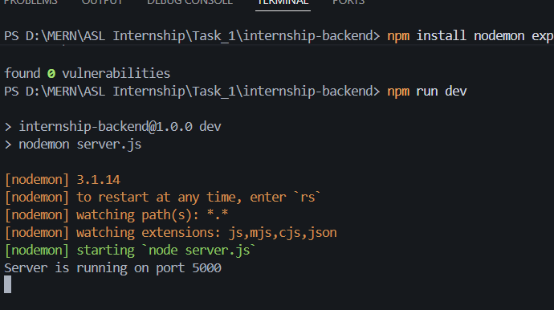
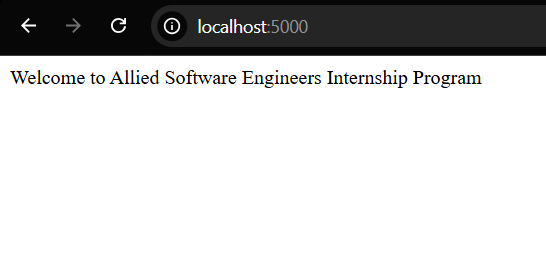
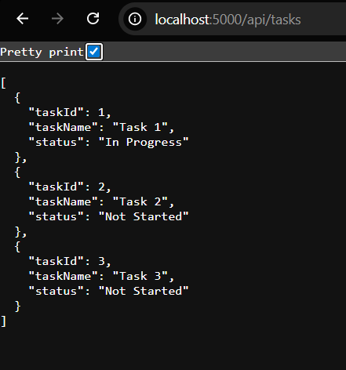
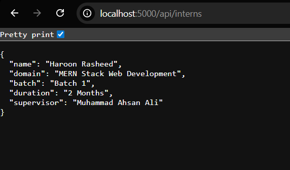
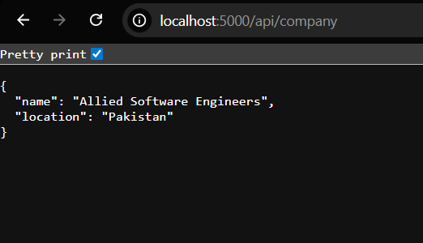

# MERN Stack Internship – Lab Task 01

## Lecture 01 – Introduction to MERN Stack

### Scenario 1 – Internship Registration Backend

**Marks:** 50

## Scenario

Allied Software Engineers has started a new internship batch. As a MERN Developer Intern, your first responsibility is to develop the backend foundation for the Internship Registration System. The HR department wants a simple Express server that can provide basic internship information through API endpoints.

## Requirements

1. Create a folder named `internship-backend`.
2. Initialize a Node.js project using `npm`.
3. Install Express.js.
4. Create an Express server running on **Port 5000**.
5. Create the following routes:

| Route | Expected Response |
| --- | --- |
| `/` | Welcome to Allied Software Engineers Internship |
| `/api/company` | Company name and location in JSON |
| `/api/intern` | Your name, domain, batch, and supervisor in JSON |
| `/api/tasks` | Return at least three internship tasks in JSON |

6. Use proper JSON formatting.
7. Verify all APIs in the browser or Postman.

## Expected Output

- Server starts successfully without errors.
- All four routes work correctly.
- JSON responses are properly structured.
- Project folder contains `package.json` and `server.js`.
- Code is organized and readable.

## Marks Distribution

- Project Setup – 10
- Express Configuration – 10
- API Development – 15
- JSON Response Quality – 10
- Code Organization & Testing – 5

## Screenshot of Completed Task
 

 

 

 

 

---

# Scenario 2 – Internship Dashboard Frontend

**Marks:** 50

## Scenario

The management team now requires a simple web interface where newly enrolled interns can view their internship information. Develop the frontend using React.

## Requirements

1. Create a React application named `internship-dashboard`.
2. Design a clean homepage.
3. Display the following information:
	- Company Name
	- Internship Title
	- Intern Name
	- Domain
	- Supervisor Name
4. Create a component named `InternCard`.
5. Display at least three internship tasks.
6. Add a button labeled `View Details`.
7. Apply basic CSS styling for a professional appearance.
8. **Bonus:** Fetch internship data from the backend API using Axios or Fetch API.

## Expected Output

- Allied Software Engineers
- MERN Stack Internship
- Intern Information Card
- Three internship tasks
- Styled button
- Clean layout with proper spacing
- **Bonus:** Live data loaded from backend API

## Marks Distribution

- React Project Setup – 10
- Component Creation – 10
- UI Design – 10
- Display of Internship Information – 10
- Styling & Code Quality – 10
