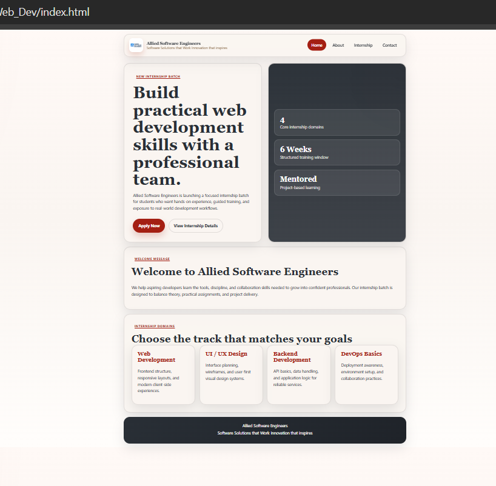
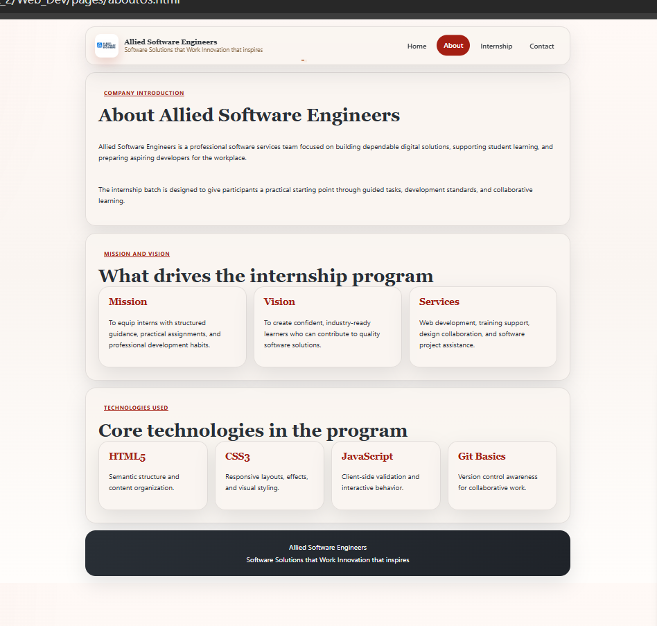
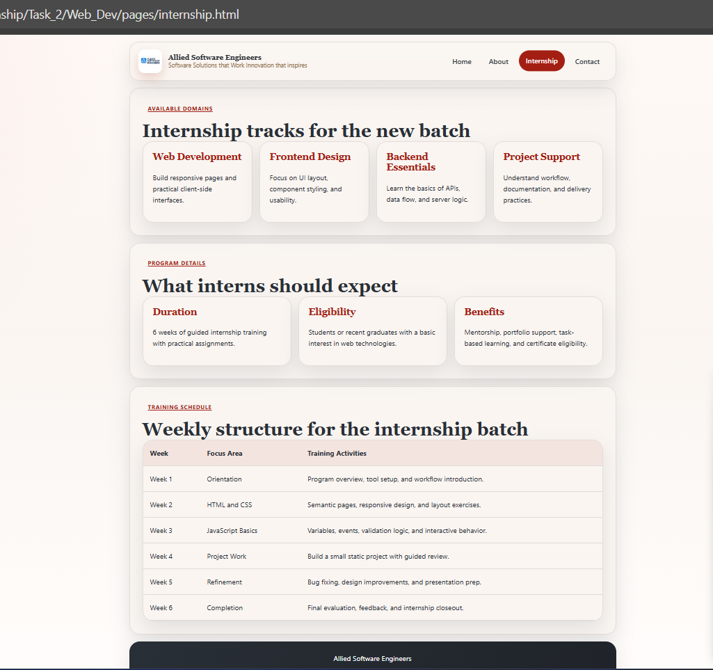
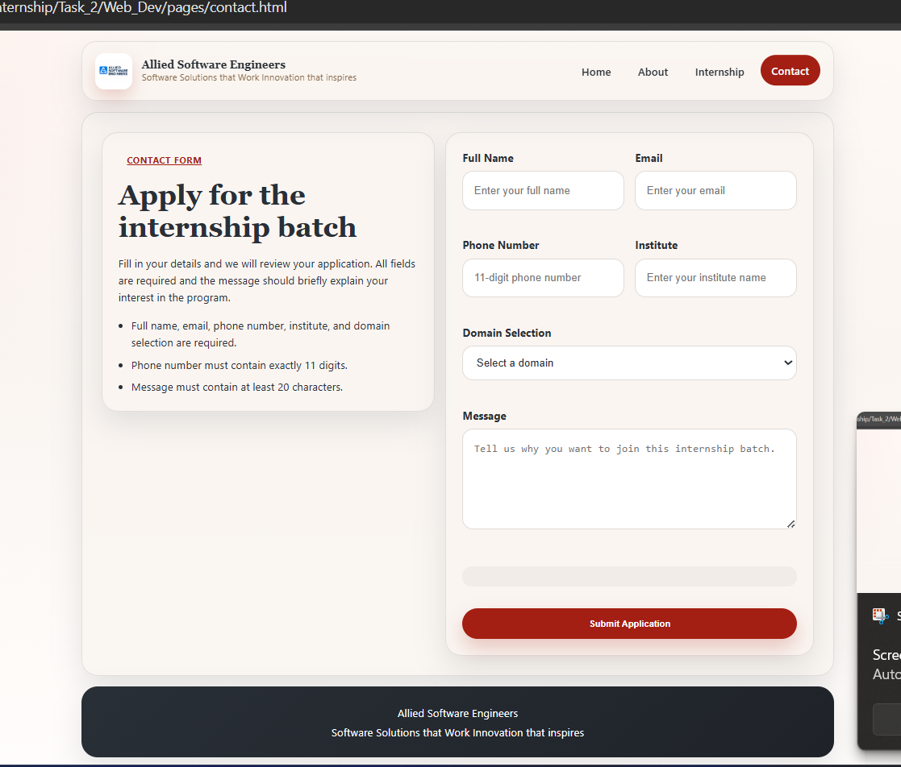

# Allied Software Engineers Internship Website

This folder contains the static internship website created for Allied Software Engineers.
It includes a responsive four-page layout with shared styling and client-side form validation.

## Pages

- `index.html` - Home page
- `pages/aboutUs.html` - About page
- `pages/internship.html` - Internship page
- `pages/contact.html` - Contact page

## Features

- responsive navigation bar
- hero section and welcome section
- internship domains cards
- company introduction, mission, vision, services, and technologies used
- internship details with table styling
- contact form with JavaScript validation
- consistent color theme and professional UI

## Technologies Used

- HTML5
- CSS3
- JavaScript

## How to Run

Open `index.html` in a browser and use the navigation links to move between pages.

## Screenshots

Add project screenshots below.

### Home Page

### About Page

### Internship Page

### Contact Page

